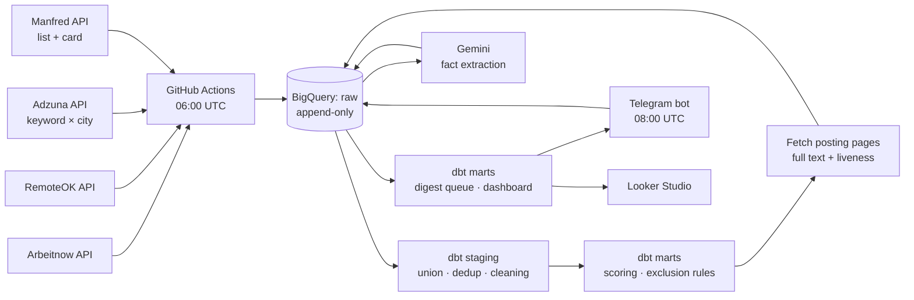

# Vacancy Radar

A daily job-market radar: collects postings from several sources every morning, loads them into BigQuery, transforms them with dbt, reads them with a language model, and delivers what's worth reading to Telegram at 10:00.

Built as a learning project, run like a real one — tests, CI, schedules, a dashboard, and a written record of every decision and what it cost. Including the two directions that were measured and abandoned.

**[Live dashboard →](https://lookerstudio.google.com/reporting/d7fc5ee9-9c42-43a1-ae8a-d08094ebc07c)**

---

## What it does

Every morning a GitHub Actions workflow collects postings from four sources and appends them to an immutable raw layer. dbt decides who is worth attention. For the survivors the pipeline fetches the **full text from the employer's posting page** — aggregator APIs return a truncated stub — and checks, by HTTP status, whether the vacancy still exists. A language model then extracts structured facts: stack, seniority, work mode, salary, required languages, residency requirements.

At 10:00 a bot sends the queue to Telegram — only postings never sent before, and only ones confirmed alive.

**16 393 distinct postings collected in 25 days, 448 of them data roles, 95 currently pass every filter, 232 delivered.** Collection ran on 24 of those 25 days.

The interesting problems here were not "how do I call an API". They were: *this field looks filled, but is it true*, *this number looks fine, but what am I comparing it to*, and *this filter works, but is it filtering the thing I meant*.

---

## Architecture



dbt runs three times per cycle, deliberately: the first pass decides who is a candidate, the later ones rebuild the queue from the text and facts gathered in between.

---

## Data model

| Layer | Objects | Materialisation | Grain |
|---|---|---|---|
| `raw` | `arbeitnow`, `adzuna`, `remoteok`, `manfred`, `remotive`, `vacancy_pages`, `llm_enrichment`, `digest_sent` | tables, append-only | one row = one event as it happened — one fetch, one model answer, one delivery |
| `staging` | `stg_vacancies`, `stg_manfred_facts`, `stg_vacancy_pages`, `stg_enrichment`, `stg_digest_sent` | views | one row = one vacancy, deduplicated, latest version wins |
| `marts` | `mart_vacancies_scored`, `mart_enrichment_candidates`, `mart_vacancies_for_me`, `mart_digest_queue`, `mart_skill_demand`, `mart_salary`, `mart_salary_facts`, `mart_dashboard_kpi` | tables and views | scored vacancies, who the model may read, the shortlist, the send queue, weekly skill demand, salary facts and aggregates, one-row dashboard summary |

The gap between the layers is the point: **30 613 rows in `raw` are 16 393 distinct postings.** The same vacancy is re-collected every morning it is still live, and raw keeps every collection as it happened. Deduplication belongs downstream, where it can be changed without losing history.

**75 dbt data tests · 113 Python tests** with the network faked out, so failure modes — a 503, a timeout, an exhausted quota, a rejected message — are exercised without an outage.

Rules that appear twice tend to drift apart, so shared logic lives in macros (`clean_html_text`, `normalize_company_name`, `normalize_job_title`, `normalize_skill`, `normalize_city`) and the "who may be enriched" rule lives in a model, not in two Python scripts.

---

## Sources

| Source | Collected | Distinct | Data roles | Passing every filter | Yield |
|---|---|---|---|---|---|
| Arbeitnow | 15 450 | 11 405 | 155 | 19 | 0.2% |
| Adzuna | 12 807 | 4 614 | 243 | 41 | 0.9% |
| **Manfred** | 240 | **60** | 50 | **35** | **58%** |
| RemoteOK | 2 082 | 297 | 0 | 0 | — |
| Remotive | 34 | 17 | 0 | 0 | **disabled** |

Sources are connected, measured, and kept or dropped on the share of postings that actually survive filtering — not on how many rows they produce. Arbeitnow supplies two thirds of the warehouse and one fifth of the shortlist. Manfred supplies 0.4% of the warehouse and more than a third of the shortlist, because it covers exactly one market (Spanish tech) and states salary, working language and remote share as structured fields.

Remotive was disabled after its API turned out to return 17 records in total and to ignore its own documented `category` parameter — verified by comparing filtered and unfiltered responses byte for byte.

A Careerjet collector exists and is tested, but sits unscheduled: their publisher key requires a website of your own, and a GitHub repository is not accepted.

---

## Where postings go

Of 16 249 postings in the current 30-day window, by the first rule that fires:

| Excluded because | Count |
|---|---|
| title is not a data role | 9 060 |
| duplicate of another posting | 3 629 |
| lead or junior | 3 149 |
| not Barcelona and not fully remote | 164 |
| posting removed by the source | 67 |
| requires a language other than English | 66 |
| requires residence in a named other country | 5 |
| sales or recruiting role matched by a data keyword | 5 |
| crowdsourced AI-training micro-task | 5 |
| language not checked yet — held, not dropped | 4 |
| **passes everything** | **95** |

---

## Dashboard

[Looker Studio, reading BigQuery directly.](https://lookerstudio.google.com/reporting/d7fc5ee9-9c42-43a1-ae8a-d08094ebc07c) Four scorecards, skill demand by week, salary ranges by role and level, a city filter.

Building it changed the marts more than the marts changed it. A BI tool aggregates whatever it is handed, and it will happily average a median or sum a share without complaining — so the dashboard is fed **facts at the finest grain** (`mart_salary_facts`, one row per vacancy with a salary) and does its own aggregation, while `mart_salary` stays available for reading and is documented as *not* further aggregable. The one exception is `mart_dashboard_kpi`: a single row of headline counts, with a test asserting it is exactly one row, because a scorecard silently showing the first of several rows is indistinguishable from a scorecard showing the truth.

---

## Decisions, and what they cost

The full log lives in [`decisions.md`](decisions.md). The ones worth reading:

**The filter measured a stand-in for what I actually wanted.** The rule excluded postings *written* in a language other than English. What I needed was postings where the *work* requires one. These correlate well enough to look right — and the rule was discarding thousands of postings on that basis. Measured against Manfred, which states the working language as a structured field: Spanish is genuinely required by 6 postings out of 60, while the old rule excluded 56. The fix reads the requirement instead of the prose; non-English ads now arrive labelled as such.

**One rule was quietly doing another rule's job.** There was no location rule at all — geography lived only in the score. German postings were being excluded for being written in German, not for being in Berlin, and the coincidence held the digest together. Removing the language filter would have flooded it. The explicit rule ("Barcelona, or fully remote") now removes 164 postings that had been arriving all along, mostly from London, Madrid and Berlin.

**The API was lying by omission.** Enrichment produced almost nothing useful for a week, and the prompt kept getting blamed. Measuring the *inputs* instead of the outputs found the cause: Adzuna truncates every description at exactly 500 characters — min 468, median 500, max 500. The fix was not a better prompt but a fetch step pulling full text from the posting page: 10–17× more text, and a stack extracted for 9 of 9 postings that had one, against 0 of 7 before.

**Liveness is an HTTP status, not a guess.** 7 of the 10 highest-ranked candidates turned out to be already removed. And a removed posting returns 404 **while still rendering its full description** — so text is stored only when the status is 200. Extract first and check second, and dead postings become indistinguishable from live ones: same field, same length, same look.

**Two correct rules, one wrong outcome.** Deduplication keeps one copy per posting; another rule excludes dead ones. Separately both are right. Together, when the surviving copy happened to be the dead one, its live twins had already been discarded as duplicates and the whole group vanished. The rule picked a representative before learning the representative was defective. Deduplication now prefers copies that are alive, in Barcelona, or remote — but only on signals known for *every* copy, which model-derived fields are not.

**The ranking measured what had been looked at, not what was good.** The relevance score included a field only enriched postings had, and only a fraction were enriched. The digest was showing the best of the examined rather than the best — and looked entirely plausible while doing it. Searching under the streetlight, with no error message to give it away.

**A selection rule must not depend on what it selects for.** Enrichment candidates are chosen *before* the language check, not after — because the language check reads a field only the model can fill. A filter that requires the output of the step it gates does not return an error; it returns an empty queue, forever.

**Counts add up, medians do not.** The first salary mart was pre-aggregated, which made every dashboard filter wrong in a way nobody would notice: filter a table of medians by city and you get the median of the medians. Facts go to the BI tool at one row per vacancy; aggregates stay for reading and carry a warning in their description.

**Two tiles on one screen must count the same thing.** A scorecard said 105 postings with a salary; the salary table beside it said 84. Both were correct — the scorecard counted any salary, the table filtered to euros per year — and no viewer could possibly know that. The fix was not a caption but a column, `with_salary_eur_year`, so both tiles read one definition out of SQL. (A related hour went into a discrepancy of exactly one, which turned out to be a table row scrolled out of view. Reconcile the big gap before believing the small one.)

**A rule about a business model, not a job title.** A family of postings titled "data analyst" turned out to be crowdsourced AI-training micro-tasks — paid per task, no employer, no location. They pass every keyword test for a data role and fail every reason to read one. Excluded by a rule of their own, so the count stays visible instead of disappearing into "irrelevant".

**One bad item must not kill the batch.** A single HTTP 503 on one of twenty city queries wiped an entire day: data collected, nothing loaded, no models built. Every step that walks a list now logs the failure, continues, and fails only if nothing at all succeeded — plus a circuit breaker after five consecutive failures, because five in a row means the service is down, not the item. Written into the project rules after the same bug surfaced in a second module.

**Test severity should match consequence.** One stray HTML entity in one description failed a test, which stopped the pipeline, which cost a day's digest. A broken key is an error; leftover markup in one text is a warning. That test now warns above zero and errors above ten.

**Every prompt version is a fresh lottery.** Comparing two versions on the same 102 postings, 3–4% of answers flipped — in both directions. Harmless while the version is stable, since each posting is read once per version. But a bump re-rolls every field of every posting, not just the ones the edit was about: one such bump turned a correct "remote" into "hybrid" and quietly dropped a good vacancy. Prompt fixes are now batched into one version, and the cost of each transition is measured by name.

**A field description beats an instruction.** "Answer in English" in the prompt body left 10 of 61 non-English postings answered in their own language. The same sentence moved into the description of each output field — where the model reads it at the moment it writes the value — left 0 of 116.

**A structured field from the source beats the model's guess.** Manfred states working language, remote share, city and salary as fields. The model infers them from prose and is occasionally wrong. Where the source states a fact, it wins; the model fills only the gaps. Nine Manfred postings reached the digest with salaries attached on a day when Gemini was down entirely.

**A fragment can only exclude if it names something.** "Spain" or an empty string in a location field does not mean "not Barcelona" — it means unknown, so only a field that names a different city may exclude. The same rule caught a residency filter reading a decontextualised quote ("for administrative reasons this is not possible") as a foreign-residency requirement, and rejecting a posting that was in fact fully remote *within* Spain. Absence of information is not evidence.

**A cap that defers is not a cap that discards.** The digest originally sent a top 10 per day, silently dropping everything below. Once delivery history existed the limit became "send at most N, leave the rest queued" — the same number, the opposite semantics.

**"Append-only" means "kept 60 days".** BigQuery's sandbox expires every table and partition after 60 days. For collected postings that is acceptable — they are re-collected daily. For `raw.digest_sent` it is not: delivery history cannot be re-derived from anywhere, and losing it means sending 200 postings again. The send step now prints the table's remaining life on every run and rebuilds it in place when under 30 days remain, verifying the row count before and after. A free tier is not free of constraints; it moves them somewhere less obvious.

**The long tail belongs in the data, not in the chart.** The skill chart kept collapsing everything past the fifth bar into "Other". Rather than fight the chart, `mart_skill_demand` gained a `skill_rank`, so the cutoff is a filter on a column and the same top-N is reproducible outside Looker.

**Two directions closed on evidence.** *Company career pages* promised day-one postings with full text. Two ways of discovering each company's job board were measured — deriving it from the company name (25% hit rate) and reading it out of collected data (0.7%) — but the decisive argument was neither number: the company list itself came from our own warehouse, so it could only ever contain companies that already publish on the aggregators we read. Sampling bias, not a tooling problem. *Telegram channels* — 23 of them, read through the public web view — produced one Barcelona data vacancy in 30 days. Their "remote" column mostly meant remote within the former USSR, paid in roubles. Both documented and dropped; the code stays in the repository.

**Deduplication key and ordering.** Duplicates resolve per key keeping the latest `ingested_at`, not the latest `posted_at`. Publication time is identical across copies, so ordering by it picks a winner at random — and the query passes its tests while silently violating its stated rule.

**Duplicates were a symptom.** A uniqueness test caught 338. The cause was offset pagination: postings published in the same second come back in unstable order, so records on a page boundary get fetched twice — which means an equal number were never fetched at all. Deduplication fixes what you can see; running daily fixes what you can't.

**No invented fields.** An early collector hardcoded `remote = true` because "the site is only about remote work". A hundred rows then confidently claimed remote for warehouse jobs in India. Invented fields look exactly like reported ones, which is what makes them dangerous.

---

## Stack

Python · BigQuery · dbt · Gemini · GitHub Actions · Telegram Bot API · Looker Studio

Free tier throughout: BigQuery sandbox, Gemini free tier, GitHub Actions on a public repository, Adzuna's free quota. Several of the more interesting decisions exist because of those ceilings — the enrichment step was designed around a 20-requests-per-day limit before a better-provisioned model was found, and the 60-day table expiry shaped how delivery history is stored.

---

## Running it locally

```bash
python -m venv .venv
source .venv/bin/activate          # Windows: .venv\Scripts\activate
pip install -r requirements.txt

# Environment: BQ_PROJECT, GOOGLE_APPLICATION_CREDENTIALS,
# ADZUNA_APP_ID, ADZUNA_APP_KEY, GEMINI_API_KEY,
# TELEGRAM_BOT_TOKEN, TELEGRAM_CHAT_ID

python -m collectors.arbeitnow
python -m collectors.remoteok
python -m collectors.adzuna
python -m collectors.manfred
python -m load.to_bigquery arbeitnow       # and remoteok, adzuna, manfred

cd dbt_radar && dbt build --profiles-dir . && cd ..   # who is a candidate

python -m fetch.adzuna_pages                          # full text + liveness
python -m enrich.with_gemini                          # extract facts

cd dbt_radar && dbt build --profiles-dir . && cd ..   # build the queue

python -m notify.telegram                             # send
python -m unittest discover -s tests -t .
```

Schedules: `collect.yml` at 06:00 UTC, `digest.yml` at 08:00 UTC. Both accept a manual run. Per-run ceilings — 100 enrichments, 60 page fetches, 100 messages — are safety valves against a broken filter, and they defer rather than discard.

---

## Roadmap

- **Source quality mart** — collected, relevant, duplicated and unique per source, so sources are kept or dropped on evidence rather than intuition. The numbers in this README were assembled by hand; they should be a model.
- **A separate dataset for experiments.** Local runs and the scheduled job write to the same tables, which has already produced one race between two prompt versions.
- **Market history.** The 30-day window is a window, not a history, and the sandbox's 60-day expiry means the tail disappears silently. Anything longer needs a deliberate decision about where history lives.

---

## A note on the code

Comments and the decision log are written in Russian — they began as working notes while learning this stack. The code, schema and this document are in English. [`STATUS.md`](STATUS.md) is a working file: what runs, what doesn't, and what was next.
