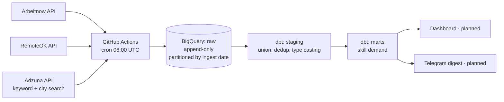

# Vacancy Radar

A daily job-market radar: collects postings from several sources every morning, loads them into BigQuery, transforms them with dbt, and turns them into something worth reading over coffee.

Built as a learning project, but run like a real one — tests, CI, a schedule, and a written record of every decision and what it cost.

---

## What it does

Every morning at 06:00 UTC a GitHub Actions workflow wakes up, collects job postings from three active sources, appends them to a raw layer in BigQuery, and rebuilds the dbt models on top — running the data tests as it goes. If a test fails, the downstream models don't get built.

The raw layer is immutable and append-only. Deduplication, type unification and cleaning happen in `staging`; aggregation happens in `marts`.

---

## Architecture



---

## Data model

| Layer | Object | Materialisation | Grain |
|---|---|---|---|
| `raw` | `arbeitnow`, `remoteok`, `remotive`, `adzuna` | tables, append-only | one row = one vacancy as returned by the source at ingest time |
| `staging` | `stg_vacancies` | view | one row = one vacancy per source, deduplicated, latest version wins |
| `marts` | `mart_skill_demand` | table | one row = one week × one skill |

Six data tests run on every build: uniqueness and not-null on the vacancy key, accepted values on the source column, not-null on mart dimensions, plus source freshness checks.

---

## Sources: measured, then chosen

Sources weren't picked from a list — they were connected, measured, and kept or dropped based on the share of postings actually relevant to data roles (keyword match on the title, word-boundary regex).

| Source | Collected | Relevant | Share | Status |
|---|---|---|---|---|
| **Adzuna** | 354 | 111 | **31%** | primary — searches by keyword and city |
| Arbeitnow | 2795 | 206 | 7% | active — general job board, high volume, low signal |
| RemoteOK | 151 | 5 | 3% | active, low priority |
| Remotive | 17 | 1 | 6% | **disabled** |

Remotive was disabled after its public API turned out to return only 17 records and ignore the `category` parameter entirely — verified by comparing responses with and without the filter (byte-identical). The collector is kept in the repository; only the scheduled run was removed.

---

## Decisions, and what they cost

The full log lives in [`decisions.md`](decisions.md). The ones worth reading:

**Deduplication key and ordering.** Duplicates are resolved per `vacancy_key` keeping the row with the latest `ingested_at` — not the latest `posted_at`. Publication time is identical across duplicates of the same posting, so ordering by it would pick a winner at random; the query would still pass its tests while silently violating the stated rule.

**Duplicates were a symptom, not the problem.** A uniqueness test caught 338 duplicate keys. The cause was offset pagination: postings published within the same second come back in an unstable order, so records on a page boundary get fetched twice — which also means an equal number were never fetched at all. Deduplication fixes what you can see; running daily fixes what you can't.

**Predicted salaries are not salaries.** Adzuna returns numeric salary fields alongside a `salary_is_predicted` flag. When the flag is set, the number is their model's estimate, not the employer's figure. Those values are stored as `NULL` rather than mixed into the same column.

**Free-text salaries are left unparsed.** One source returns salary as free text (`"$50,000 - $70,000"`, `"€40/hour"`, empty). It's stored verbatim in a separate field; the numeric columns stay empty. An empty field is more honest than a plausible wrong number, and parsing it is a job for a language model, not a regex.

**No invented fields.** An early collector hardcoded `remote = true` because "the site is only about remote work". The data disagreed — a hundred rows confidently claimed remote for warehouse jobs in India. Fields we invent look exactly like fields the source gave us, which makes them dangerous. Adzuna doesn't report work mode, so that column is `NULL`.

**Explicit casts in the union.** Schema auto-detection gave the same logical field different types across sources, which only surfaced when the sources were unioned. Types are now cast explicitly, and identifiers are cast to string — the next source may well use letters.

**Scheduler, not orchestrator.** GitHub Actions runs the pipeline: free, no infrastructure, and enough for three sources with no interdependencies. It cannot retry a failed step or model dependencies between datasets. Airflow becomes worth its operational cost when the source count and the dependency graph grow — not before.

**Secrets never live in the repository.** Credentials come from environment variables locally and from repository secrets in CI. The dbt profile contains only variable names, which is why it can be committed at all.

---

## Stack

Python · BigQuery · dbt (dbt-bigquery) · GitHub Actions · Git

---

## Running it locally

```bash
python -m venv .venv
source .venv/bin/activate          # Windows: .venv\Scripts\activate
pip install -r requirements.txt

# Environment: BQ_PROJECT, GOOGLE_APPLICATION_CREDENTIALS,
# ADZUNA_APP_ID, ADZUNA_APP_KEY

python -m collectors.arbeitnow
python -m collectors.adzuna
python -m load.to_bigquery arbeitnow
python -m load.to_bigquery adzuna

cd dbt_radar
dbt build --profiles-dir .
```

`python -m collectors.inspect_data data/raw_adzuna.jsonl` prints a quick profile of any collected file — row counts, duplicates, empty fields, most common locations.

---

## Roadmap

- **Enrichment with a language model** — extract stack, seniority, work mode, visa support and salary from the posting text; embeddings to merge the same vacancy across sources and to score relevance against a specific profile.
- **Telegram digest** — the ten most relevant fresh postings, delivered daily.
- **Dashboard** — skill demand over time, salary ranges by city, share of remote postings.
- **Source quality mart** — postings collected, relevant, duplicated and unique per source, so sources can be kept or dropped on evidence rather than intuition.
- **Company career pages** — Greenhouse, Lever, Ashby, Workable, Recruitee and Personio all expose public job endpoints. Postings appear there on day one, before aggregators pick them up.

---

## A note on the code

Comments and the decision log are written in Russian — they started as my own working notes while learning this stack. The code, schema and this document are in English.
